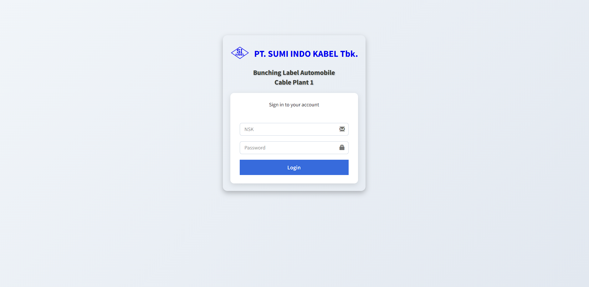

# 📦 Bunching Label – Laravel 7.2

Aplikasi **Sistem Informasi Pencetakan & Manajemen Label** yang dibangun menggunakan **Laravel 7.2**.  
Didesain untuk membantu operator dalam membuat, mengedit, mencetak, dan mengelola data label produksi secara efisien.  

---

## 🚀 Fitur Utama

- ✨ Autentikasi **Admin & Operator**  
- 🏷️ Generate & Print **Label Produksi** (Lot Number otomatis dengan increment)  
- 📅 Filter & Export Data Label (Excel / PDF)  
- 🔄 CRUD Data Label (tambah, edit, hapus)  
- 📊 Dashboard monitoring data label  
- 🖨️ Tampilan **print-friendly** untuk label  

---

## 🛠️ Teknologi yang Digunakan

- **Framework**: Laravel 7.2  
- **Database**: MySQL/MariaDB  
- **Template Engine**: Blade  
- **Front-End**: Bootstrap  
- **Export**: [Maatwebsite Excel](https://github.com/Maatwebsite/Laravel-Excel), [DomPDF](https://github.com/barryvdh/laravel-dompdf)  

---

## 📂 Struktur Folder Penting

```
app/
 ├── Http/Controllers/Web/IndexController.php   # Controller utama
 ├── Label.php                                  # Model Label
 └── Increment.php                              # Model Increment

resources/views/web/dashboard/                  # Halaman Dashboard & Form
resources/views/export/                         # Template Export PDF & Excel
```

---

## ⚡ Instalasi & Setup

1. Clone repository
   ```bash
   git clone https://github.com/username/bunching-label.git
   cd bunching-label
   ```
2. Install dependency
   ```bash
   composer install
   npm install && npm run dev
   ```
3. Copy file `.env.example` menjadi `.env`
   ```bash
   cp .env.example .env
   ```
4. Generate key
   ```bash
   php artisan key:generate
   ```
5. Setting database di `.env`, lalu migrate
   ```bash
   php artisan migrate
   ```
6. Jalankan server lokal
   ```bash
   php artisan serve
   ```

---

## 📸 Screenshot



---

## 🤝 Kontribusi

Pull request selalu terbuka.  
Silakan buat issue terlebih dahulu untuk fitur baru atau bug fix.  

---

## 📄 Lisensi

Proyek ini menggunakan lisensi [MIT](https://opensource.org/licenses/MIT).  
